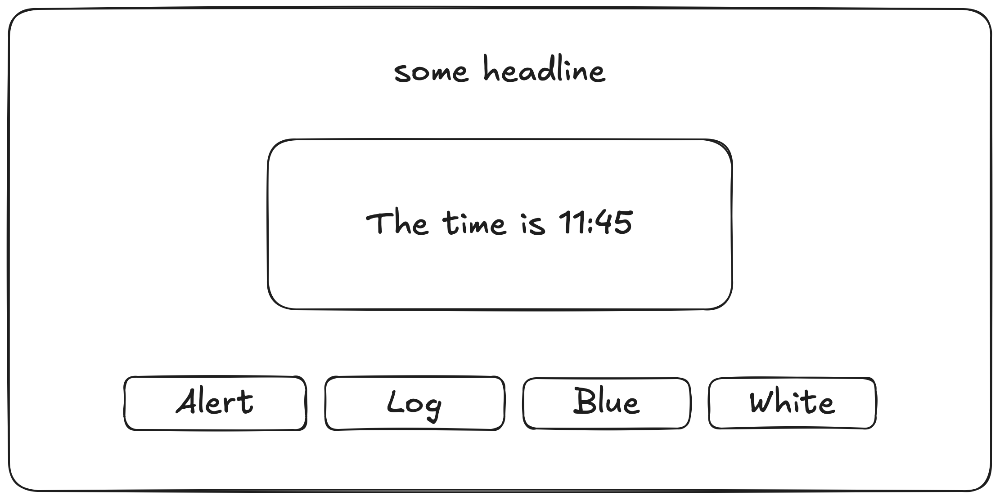

# Review Week 10

## Setup

- Create your own `review-week-10` repository
- Setup an `index.html`, a linked stylesheet named `index.css` and a linked JavaScript file named `index.js`

## Project Brief

For this review, you're making a simple app.



## Acceptance Criteria

1. Has a large headline on the top
2. Shows the current time in the middle of the page in the format `The time is HH:mm`.

   Example: `The time is 14:12`. `The time is 11:49`.
3. Has one button that, when clicked, alerts the user to "stop clicking the button".
4. Has one button that, when clicked, logs the current time to the console.
5. Has one button that, when clicked, sets the background color of all buttons to blue.
6. Has one button that, when clicked, sets the background color of all buttons to white.

The order of the buttons as well as their labels, do not matter

## Hints

- To get the current time, you can use some code like the following:

  ```js
  const time = new Date();
  const hours = time.getHours();
  const mins = time.getMinutes();
  ```

- To alert a user, you can use the `alert()` function.

## Grading Key

70 points possible. 35 points needed to pass.

- 60 points for all acceptance criteria (10 points for each)
- 10 points for code quality:
  - proper formatting
  - sensible comments
  - no unnecessary repetition

### Good luck!
